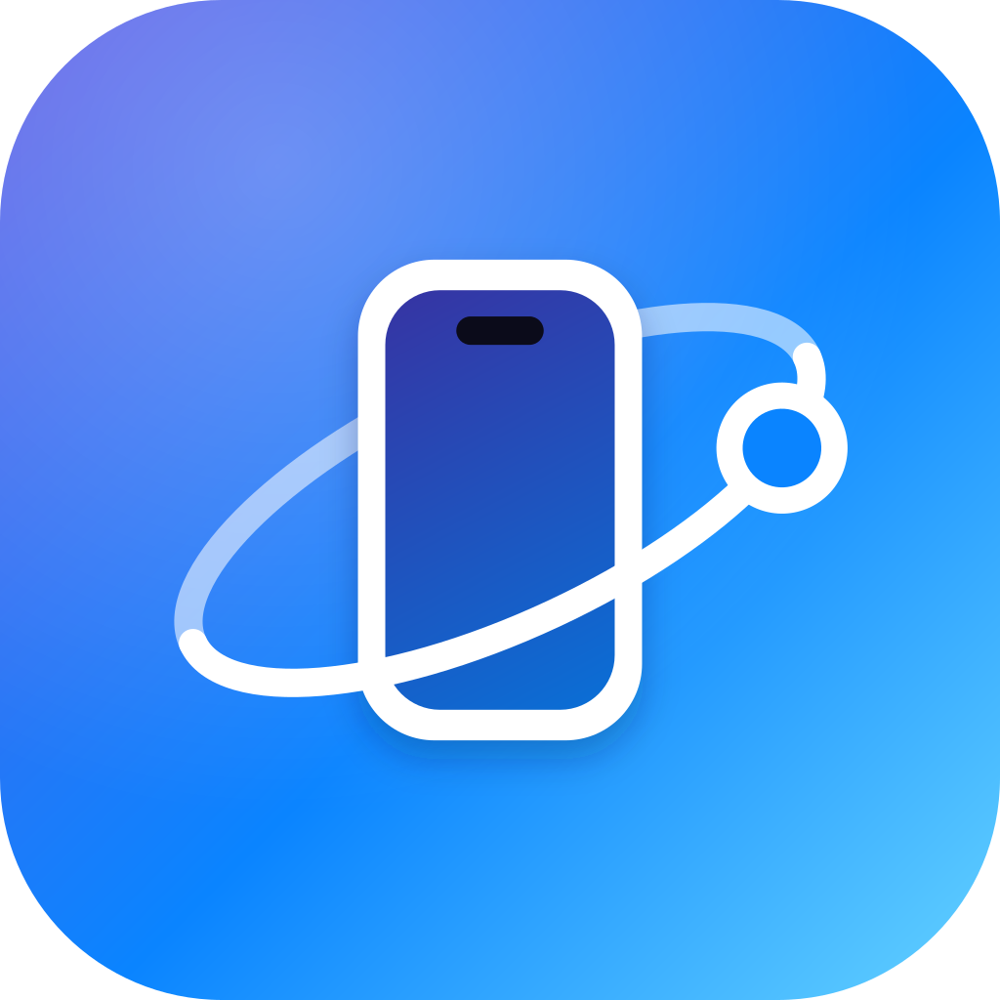

<p align="center">
  
</p>

# Orbit

Orbit lets you use a Wear OS watch with an iPhone. Your iPhone notifications, calls and music show up on the watch, and you don't need to install anything on the iPhone.

Based on [WearBridge](https://github.com/k97/WearBridge) by Karthik Rajendran (MIT license).

## Features

**Pairing**
- Pair from iPhone **Settings > Bluetooth**. No iPhone app needed.
- Reconnects on its own after you walk out of range, turn Bluetooth off and on, or restart the watch.
- Buzzes once if you leave your iPhone behind.

**Notifications**
- Every iPhone notification shows up on the watch within a second.
- Each app shows its real icon.
- Long messages and emails show in full, not cut off. The hidden filler text that some emails add is removed.
- Clear a notification on the watch and it clears on the iPhone. Clear it on the iPhone and it leaves the watch.
- The iPhone's own notification buttons (like "Clear" or "Dial") work on the watch.
- Notifications are grouped by app.
- Quiet notifications on the iPhone (Focus, Deliver Quietly) stay quiet on the watch.
- Notifications that arrived while the watch was away show up quietly when it reconnects.

**Per-app settings**
- Set each iPhone app to Alert, Quiet or Off.
- Pick a vibration style per app: Default, Tap, Double or Long.

**Calls**
- A full-screen call screen with the caller's name, even on the lock screen.
- The watch keeps vibrating until you answer, decline or press the side button.
- Answer and Decline work on the iPhone. End Call works during a call.
- WhatsApp and FaceTime calls work too.

**Music**
- See what is playing on the iPhone and control it: play, pause, skip and volume.
- Turn the crown to change the iPhone volume.
- The music screen opens by itself when playback starts.

**iPhone status**
- iPhone battery level on the home screen, a tile and a watch face complication.
- A clock check that tells you if the watch time differs from the iPhone.

**Watch face**
- An "iPhone" tile with connection, battery and music controls.
- "iPhone Battery" and "iPhone Now Playing" complications.

## Limitations

These need Apple's help, so they can't be done:
- Replying to iMessage or SMS with typed text
- iPhone alarms and timers on the watch
- Taking call audio on the watch
- Setting the watch clock from the iPhone
- Apple Pay, Siri, unlocking the iPhone or Mac, and Activity rings

## Maybe Later

- Take calls on the watch speaker and mic
- Use the watch as a remote for the iPhone camera and music
- "Ping my iPhone" to find it
- iCloud Calendar on the watch
- Switch between more than one iPhone or watch

## Tested On

| Device | Version |
|--------|---------|
| iPhone 17 Pro | iOS 27 |
| Google Pixel Watch 3 (41 mm) | Wear OS, Android 17 |

## How It Works

iOS has built-in Bluetooth services that any paired accessory can use. Orbit uses four of them: notifications (ANCS), music (Apple Media Service), battery and current time.

1. The watch makes itself visible to the iPhone. You tap it in Settings > Bluetooth.
2. After pairing, the watch subscribes to the iPhone's notifications, music, battery and time.
3. For each new notification, the watch asks the iPhone for the details and shows it.
4. Buttons you tap on the watch (Answer, Decline, Clear) are sent back to the iPhone.

Protocol details are in [`docs/protocol.md`](docs/protocol.md).

## Battery

Expect about **3 to 6% less battery per day** on the watch.

- On a Pixel Watch 3, Orbit used about 1.8% of all app CPU time during a day of heavy testing. It sleeps between notifications.
- Keeping the Bluetooth link open adds about 2 to 4% per day. This part is an estimate, because Wear OS doesn't track Bluetooth use per app.
- If the watch is still paired with an Android phone that stays nearby, that link uses extra battery. Turning that phone's Bluetooth off saves it.

## Build and Install

Build with Android Studio's bundled Java (JBR 21):

```bash
cd wearos-app
# macOS
JAVA_HOME="/Applications/Android Studio.app/Contents/jbr/Contents/Home" ./gradlew testDebugUnitTest assembleRelease
# Windows (Git Bash)
JAVA_HOME="C:/Program Files/Android/Android Studio/jbr" ./gradlew.bat testDebugUnitTest assembleRelease \
  -Porg.gradle.java.installations.paths="C:/Program Files/Android/Android Studio/jbr"
```

Install it on the watch over Wi-Fi ADB (turn on Developer options > Wireless debugging on the watch):

```bash
adb install -r app/build/outputs/apk/release/app-release.apk
# Lets the call screen and music screen open on their own:
adb shell appops set com.wearos.ancsbridge SYSTEM_ALERT_WINDOW allow
adb shell appops set com.wearos.ancsbridge USE_FULL_SCREEN_INTENT allow
```

Use the release build. The debug build is much slower on a watch.

## Setup

1. Open Orbit on the watch and allow the permissions it asks for.
2. Tap **Pair New Device**, then **Start Pairing**.
3. On the iPhone, open **Settings > Bluetooth** and tap the watch's name.
4. Tap **Pair**, then **Allow** when the iPhone asks to share notifications.

That's it. Notifications start right away.

If the watch doesn't show up in Settings > Bluetooth, connect to it once with a Bluetooth scanner app like nRF Connect. The watch will then ask to pair.

You can also add the **iPhone** tile and the complications from the watch face editor. App settings are under **Settings** in Orbit.

## Project Structure

```
wearos-app/app/src/main/java/com/wearos/ancsbridge/
├── ble/        Bluetooth connection, pairing, iPhone services
├── ancs/       Notifications, calls, app icons
├── media/      Now Playing
├── surfaces/   Tile and complications
├── settings/   Per-app settings
├── model/      Data classes
├── ui/         Watch screens
└── viewmodel/  Screen state
```

## License

MIT. See [LICENSE](LICENSE).
