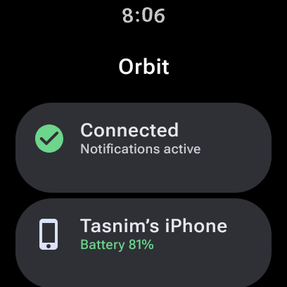
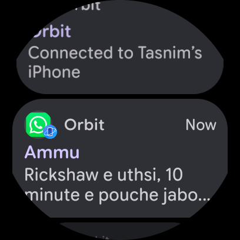
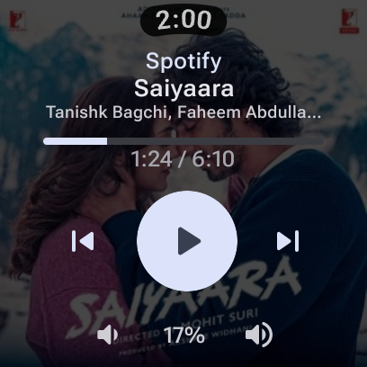
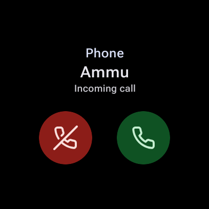
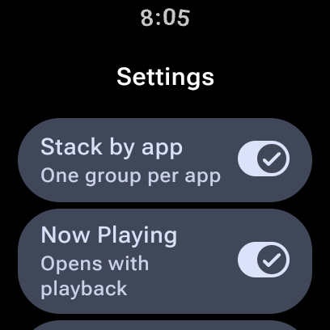
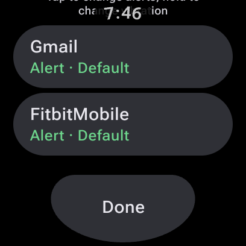

<p align="center">
  
</p>

# Orbit

Orbit lets you use a Wear OS watch with an iPhone. Your iPhone notifications, calls and music show up on the watch, and you don't need to install anything on the iPhone.

Based on [WearBridge](https://github.com/k97/WearBridge) by Karthik Rajendran (MIT license).

<p align="center">
  
  
</p>
<p align="center">
  
  
</p>
<p align="center">
  
  
</p>

<p align="center"><i>Real screens from a Pixel Watch 3 paired to an iPhone 17 Pro.</i></p>

## Features

**Pairing**
- Pair from iPhone **Settings > Bluetooth**. No iPhone app needed.
- Reconnects on its own after you walk out of range, turn Bluetooth off and on, or restart the watch.
- Buzzes once if you leave your iPhone behind.

**Notifications**
- Every iPhone notification shows up on the watch within a second.
- Each app shows its real icon, and its real name, asked from the iPhone itself.
- Long messages and emails show in full, not cut off. The hidden filler text that some emails add is removed.
- Clear a notification on the watch and it clears on the iPhone. Clear it on the iPhone and it leaves the watch.
- The iPhone's own notification buttons (like "Clear" or "Dial") work on the watch.
- Notifications are grouped by app.
- Quiet notifications on the iPhone (Focus, Deliver Quietly) stay quiet on the watch.
- Notifications that arrived while the watch was away show up quietly when it reconnects.
- No buzzing while the watch is off your wrist (on its charger, on the table), like an Apple Watch. The iPhone still alerts as usual. You can turn this off.

**Per-app settings**
- Set each iPhone app to Alert, Quiet or Off.
- Pick a vibration style per app: Default, Tap, Double or Long.
- "Mute 1 hr" on any notification: that app's notifications arrive quietly for an hour. Settings shows "Muted until …", and one tap there unmutes it.

**Calls**
- A full-screen call screen with the caller's name, even on the lock screen.
- The watch keeps vibrating until you answer, decline or press the side button. It doesn't vibrate while the watch is off your wrist.
- Answer and Decline work on the iPhone. End Call works during a call.
- During a call a phone icon sits on the watch face. Tap it for the call, its running time and End Call.
- WhatsApp and FaceTime calls work too.

**Music**
- See what is playing on the iPhone and control it: play, pause, next and previous.
- Skip forward and back inside a track, for podcasts, plus shuffle, repeat, like and dislike. Each button shows only when the player supports it.
- Shows the track's place in the queue, like "3 of 21", for players that report it.
- Turn the crown to change the iPhone volume.
- Album art behind the controls, in the tile and in the notification, found by the song's name. This sends the song's title and artist to Apple's public search; turn "Album art" off in Settings to stop it.
- A song that is already playing shows up as soon as the watch reconnects.
- The watch's own media controls work too, including its media screen and volume.
- The music screen opens by itself when playback starts on the iPhone.

**iPhone status**
- iPhone battery level on the home screen, a tile and a watch face complication.
- A clock check that tells you if the watch time differs from the iPhone.

**Watch face**
- An "iPhone" tile with connection, battery, the song with its album art, and a play/pause button.
- "iPhone Battery" and "iPhone Now Playing" complications.
- A music icon while something plays, and a phone icon during a call.

**Looks like the rest of the watch**
- Built with Material 3 for Wear OS, so it matches the system apps.
- Takes its colours from your watch face when the watch offers a theme.
- The clock stays on screen, lists scroll the way Wear OS lists do, and each screen has one main action on the bottom edge.

## Privacy

Everything stays between the watch and the iPhone, with two exceptions, both to Apple's public App Store search (no account, over HTTPS):
- **App icons**: the app's bundle ID (like `net.whatsapp.WhatsApp`), once per app.
- **Album art**: the song's title and artist, or the podcast's name, once per album. Turn "Album art" off in Settings to stop it.

Nothing is backed up or sent anywhere else, and release builds keep message text, caller names and Bluetooth addresses out of the watch's logs.

## Limitations

These need Apple's help, so they can't be done:
- Replying to iMessage or SMS with typed text
- iPhone alarms and timers on the watch
- Taking call audio on the watch
- Setting the watch clock from the iPhone
- Apple Pay, Siri, unlocking the iPhone or Mac, and Activity rings

## Maybe Later

- Take calls on the watch speaker and mic
- "Ping my iPhone" to find it
- iCloud Calendar on the watch
- Switch between more than one iPhone or watch

## Tested On

| Device | Version |
|--------|---------|
| iPhone 17 Pro | iOS 27 |
| Google Pixel Watch 3 (41 mm) | Wear OS, Android 17 |

## How It Works

iOS has built-in Bluetooth services that any paired accessory can use. Orbit uses four of them: notifications (ANCS), music (Apple Media Service), battery and current time.

1. The watch makes itself visible to the iPhone. You tap it in Settings > Bluetooth.
2. After pairing, the watch subscribes to the iPhone's notifications, music, battery and time.
3. For each new notification, the watch asks the iPhone for the details and shows it.
4. Buttons you tap on the watch (Answer, Decline, Clear) are sent back to the iPhone.

Protocol details are in [`docs/protocol.md`](docs/protocol.md).

## Battery

Expect about **3 to 6% less battery per day** on the watch.

- On a Pixel Watch 3, Orbit used about 1.8% of all app CPU time during a day of heavy testing. It sleeps between notifications.
- Keeping the Bluetooth link open adds about 2 to 4% per day. This part is an estimate, because Wear OS doesn't track Bluetooth use per app.
- If the watch is still paired with an Android phone that stays nearby, that link uses extra battery. Turning that phone's Bluetooth off saves it.
- Album art needs the internet, which on a watch without a phone means Wi-Fi, the watch's biggest battery cost. Covers are looked up once per album and kept, and songs with no match aren't asked about again for three days. Turn "Album art" off to avoid it entirely.

## Install

Download `orbit.apk` from the [latest release](https://github.com/tasnim7ahmed/Orbit/releases/latest).

Turn on Developer options and Wireless debugging on the watch (Settings > System > About > Versions, tap Build number seven times), then pair your computer with `adb pair` and install:

```bash
adb install orbit.apk
# Lets the call screen and music screen open on their own:
adb shell appops set com.wearos.ancsbridge SYSTEM_ALERT_WINDOW allow
adb shell appops set com.wearos.ancsbridge USE_FULL_SCREEN_INTENT allow
```

Pixel Watches have no USB data connection, so Wi-Fi ADB is the way in.

## Build It Yourself

Build with Android Studio's bundled Java (JBR 21):

```bash
cd wearos-app
# macOS
JAVA_HOME="/Applications/Android Studio.app/Contents/jbr/Contents/Home" ./gradlew testDebugUnitTest assembleRelease
# Windows (Git Bash)
JAVA_HOME="C:/Program Files/Android/Android Studio/jbr" ./gradlew.bat testDebugUnitTest assembleRelease \
  -Porg.gradle.java.installations.paths="C:/Program Files/Android/Android Studio/jbr"
```

Then install `app/build/outputs/apk/release/app-release.apk` as above. Use the release build; the debug build is much slower on a watch.

Your own build is signed with the debug key, so it will not install on top of a release download. Uninstall first if you want to switch between them.

## Setup

1. Open Orbit on the watch and allow the permissions it asks for.
2. Tap **Pair iPhone** at the bottom of the screen, then **Start pairing**.
3. On the iPhone, open **Settings > Bluetooth** and tap the watch's name.
4. Tap **Pair**, then **Allow** when the iPhone asks to share notifications.

That's it. Notifications start right away.

If the watch doesn't show up in Settings > Bluetooth, connect to it once with a Bluetooth scanner app like nRF Connect. The watch will then ask to pair.

You can also add the **iPhone** tile and the complications from the watch face editor. App settings are under **Settings** in Orbit, which is also where you pair another iPhone later, even while one is connected.

## Project Structure

```
wearos-app/app/src/main/java/com/wearos/ancsbridge/
├── ble/        Bluetooth connection, pairing, iPhone services
├── ancs/       Notifications, calls, app icons
├── media/      Now Playing
├── surfaces/   Tile and complications
├── settings/   Per-app settings
├── model/      Data classes
├── ui/         Watch screens
└── viewmodel/  Screen state
```

## License

MIT. See [LICENSE](LICENSE).
